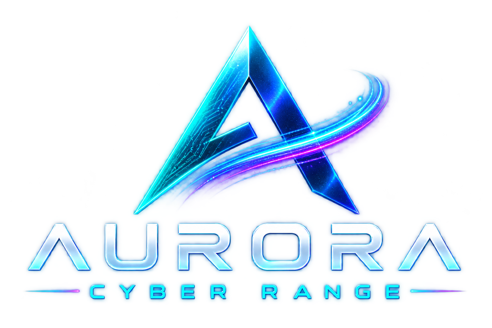

# Identidade visual — Aurora Cyber Range

Quatro arquivos originais fornecidos pelo mantenedor para reutilização na identidade visual do projeto. Os PNGs foram copiados sem edição, recorte, redimensionamento, recompressão ou alteração de transparência. Apenas os nomes dos arquivos foram normalizados.

## Arquivos

| Arquivo | Conteúdo | Dimensões | Transparência |
| --- | --- | --- | --- |
| [aurora-cyber-range-logo-landscape.png](aurora-cyber-range-logo-landscape.png) | Logotipo completo, formato horizontal | 1536 × 1024 | Canal alfa com transparência |
| [aurora-cyber-range-logo-square.png](aurora-cyber-range-logo-square.png) | Logotipo completo, formato quadrado | 1254 × 1254 | Canal alfa com transparência |
| [aurora-cyber-range-symbol.png](aurora-cyber-range-symbol.png) | Símbolo isolado | 1254 × 1254 | Canal alfa com transparência |
| [aurora-cyber-range-key-visual.png](aurora-cyber-range-key-visual.png) | Arte de apresentação com composição de marca | 1672 × 941 | Imagem opaca |

Os dois logotipos são variantes distintas; preservar ambos. O [manifesto](manifest.json) registra os nomes originais, tamanhos, dimensões, SHA-256 e identificadores Git dos quatro PNGs.

## Referência para desenvolvimento

- Reutilizar os arquivos fornecidos ao aplicar a marca Aurora Cyber Range. Preservar proporções e manter eventuais derivados separados dos originais.
- Os elementos visuais observáveis incluem azul, ciano, violeta/magenta e lettering claro. Este conjunto não inclui especificação de cores em HEX, arquivos de fontes, guia tipográfico, vetores ou modelos 3D; não atribuir valores ou famílias tipográficas oficiais por suposição.
- Os arquivos identificam a plataforma **Aurora Cyber Range**. Eles não estabelecem, por si, uma marca institucional separada da universidade fictícia **UniAurora**. A aplicação dentro de placas e ambientes da faculdade precisa respeitar essa distinção.
- A arte de apresentação é referência gráfica. Os números, horários, estados e ocorrências nela desenhados não constituem evidências, telemetria real, fatos canônicos do cenário ou funcionalidades implementadas.
- Este conjunto não substitui a especificação do projeto nem contém uma cena 3D executável.

## Proveniência e integridade

Origem: quatro anexos fornecidos pelo mantenedor nesta conversa, com autorização expressa para inclusão no GitHub. O nome original de cada anexo está preservado no manifesto.

A conferência compara os bytes de cada PNG com o anexo original. Os nomes de arquivo originais não são utilizados como evidência independente de data de criação.
